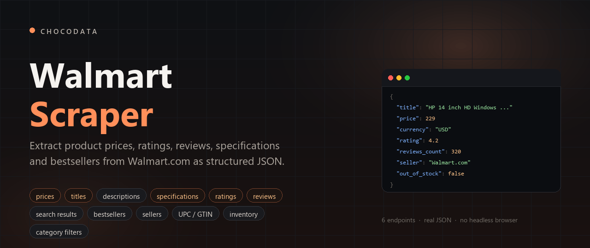
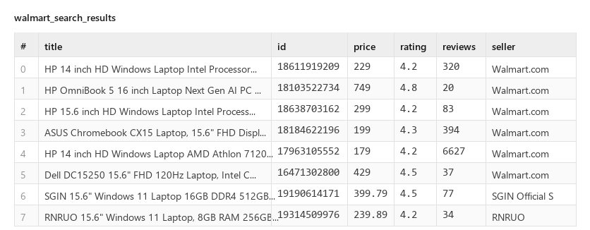
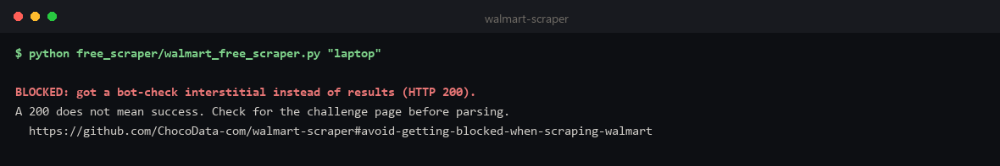
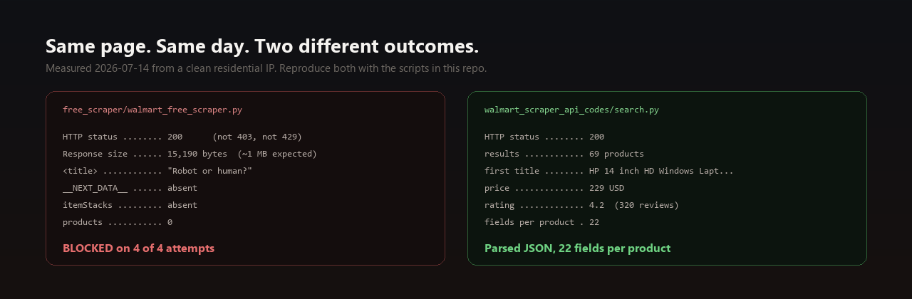
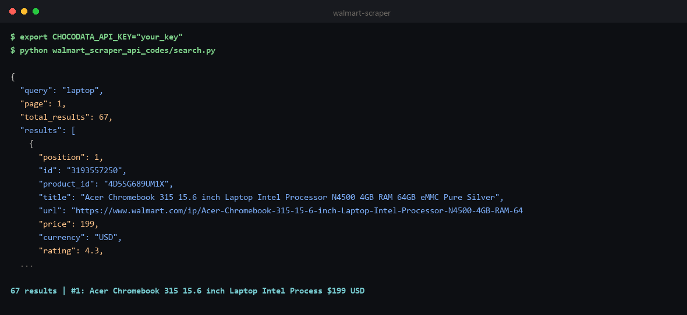
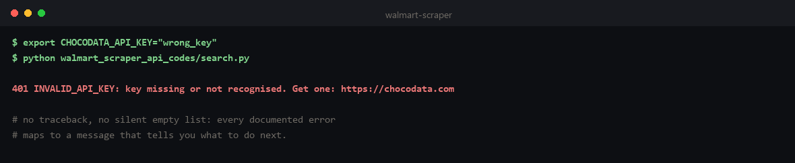
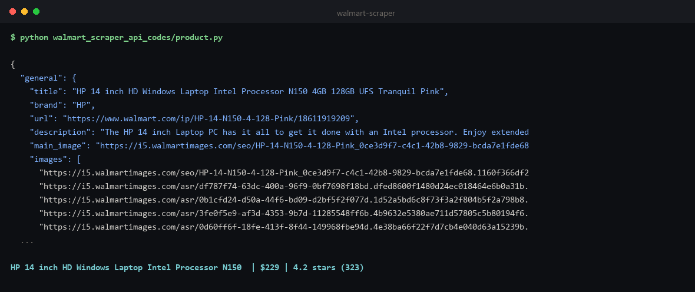
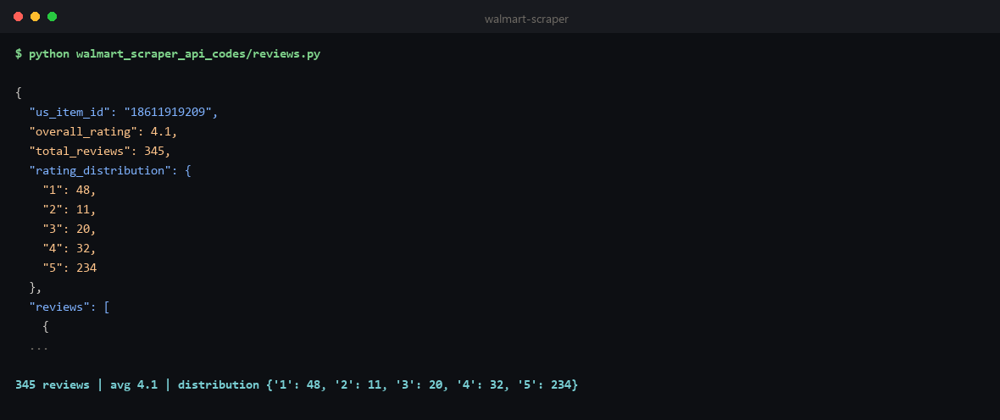

# Walmart Scraper



**Walmart Scraper for extracting product prices, titles, descriptions, specifications, ratings, reviews, search results and bestsellers from Walmart.com.** This repo has a free Walmart web scraping script you can run right now, and a Walmart product data API with 6 endpoints returning real structured JSON.

**Last updated: 2026-07-17.** Working against Walmart.com as of July 2026, and re-verified whenever Walmart changes their markup.

Every JSON block on this page was captured from the live API on 2026-07-14, with long arrays trimmed to the first item or two and each block noting exactly what was cut. The full uncut samples are committed in [`walmart_scraper_api_data/`](walmart_scraper_api_data), and every code example calls the API and is runnable from [`walmart_scraper_api_codes/`](walmart_scraper_api_codes).

```bash
pip install requests
export CHOCODATA_API_KEY="your_key"     # free: 1,000 requests, one-time, no card
python walmart_scraper_api_codes/search.py
```

Those three lines return this, live from Walmart.com:

```json
{
  "position": 1,
  "id": "18611919209",
  "title": "HP 14 inch HD Windows Laptop Intel Processor N150 4GB 128GB UFS Tranquil Pink",
  "price": 229,
  "currency": "USD",
  "rating": 4.2,
  "reviews_count": 320,
  "seller": "Walmart.com",
  "out_of_stock": false,
  "free_shipping": true
}
```

...multiplied by 69 products, with 22 fields each:



That is the whole point of this repo. The rest of this page is the free script, the wall it hits, and the six endpoints with the parameters and response for each.

---

## Contents

- [Free Walmart Scraper](#free-walmart-scraper)
- [Avoid getting blocked when scraping Walmart](#avoid-getting-blocked-when-scraping-walmart)
  - [Using the Chocodata Walmart Scraper API](#using-the-chocodata-walmart-scraper-api)
- [Walmart Scraper API reference](#walmart-scraper-api-reference)
  - [Quickstart](#quickstart) · [Authentication](#authentication) · [Global parameters](#global-parameters) · [Errors](#errors) · [Rate limits and concurrency](#rate-limits-and-concurrency)
  - [1. Search](#1-search-product-listings-prices-and-ratings) · [2. Product](#2-product-full-product-data-specifications-and-upcgtin) · [3. Reviews](#3-reviews-customer-ratings-and-review-text) · [4. Bestsellers](#4-bestsellers-top-selling-product-listings-by-category) · [5. Filters](#5-filters-category-facets-and-sort-options) · [6. Related queries](#6-related-queries-walmart-keyword-research-data)
- [Monitor Walmart price changes](#monitor-walmart-price-changes)
- [Measured latency](#measured-latency)

---

## Free Walmart Scraper

Walmart server-renders its search results into a `__NEXT_DATA__` JSON blob, so when a request gets through you can extract structured data from Walmart product pages without a headless browser or JavaScript rendering. No key, no cost:

```bash
python free_scraper/walmart_free_scraper.py "laptop"
```

Source: [`free_scraper/walmart_free_scraper.py`](free_scraper/walmart_free_scraper.py). It finds the `__NEXT_DATA__` blob, walks to `props.pageProps.initialData.searchResult.itemStacks`, and emits `id, title, price, currency, rating, reviews_count, url, seller`.

After running the command, your terminal should look something like this:



That is the outcome, and the next section is about why.

## Avoid getting blocked when scraping Walmart

We ran exactly that script from a clean residential IP while writing this README, 4 times. All 4 returned the same thing:

```
BLOCKED: got a bot-check interstitial instead of results (HTTP 200).
A 200 does not mean success. Check for the challenge page before parsing.
```

Here is the raw evidence behind that message:

| What we measured | Value |
|---|---|
| HTTP status | **200** (not 403, not 429) |
| Response size | **15,190 bytes** (a real results page is ~1 MB) |
| `<title>` | **`Robot or human?`** |
| `__NEXT_DATA__` blob | **absent** |
| `itemStacks` | absent |
| Markers found | `Robot or human?`, `px-captcha` |



A 15 KB page titled "Robot or human?" returned with a 200 status. That single row is the whole problem in miniature, and it is the most important thing to understand about scraping Walmart:

| What bites you | Why | What it costs you |
|---|---|---|
| **HTTP 200 is not success** | Walmart serves its bot check with a `200` status, not a `403`. A naive scraper parses it, finds nothing, and logs "0 results" rather than "blocked". | The expensive failure is not a crash. It is three weeks of empty data that looked like "no results". |
| **It is not a header problem** | Walmart fingerprints the connection itself, not just the `User-Agent`. No combination of headers makes a stock HTTP client look like a browser. | You cannot patch your way out in code. It is an infrastructure problem. |
| **Datacenter IPs are pre-blocked** | AWS, GCP and Azure ranges are well known. This is why the script above fails instantly from CI even when it works from your laptop. | Clean IP supply is a recurring bill, not a one-off fix. |
| **The JSON path moves** | `itemStacks` and the `__NEXT_DATA__` shape change a few times a year. Your parser silently returns `[]`. | Ongoing maintenance, plus alerting smart enough to tell "empty" from "broken". |
| **Per-geo pricing** | Walmart localises price and availability to the IP it sees. Uncontrolled egress returns a different currency per call. | Prices you cannot compare to each other, which is fatal for repricing. |

Two things worth knowing before you go shopping for a free alternative. Every other "free Walmart scraper" on GitHub hits the same wall this one does: the ones that fetch Walmart directly are blocked, and several of the ones that look like they work are wrappers that need a paid vendor's API key anyway. And the wall is not a code problem: it is the reason the API below exists.

---

### Using the Chocodata Walmart Scraper API

The [Chocodata Walmart Scraper API](https://chocodata.com/scraper-api/walmart?utm_source=github&utm_medium=repo&utm_campaign=walmart-scraper) is the managed option, and the one this repo is built around. Six endpoints for Walmart product data extraction at scale (search listings, product pages, reviews, bestsellers, category filters and related queries), a ~99% success rate against the bot check, and no proxy management. Free for the first 1,000 requests.

---

## Walmart Scraper API reference

Below is the Walmart Scraper API reference: authentication, the global parameters, errors and rate limits, then each of the six endpoints with its parameters and response.

### Quickstart

```bash
curl "https://api.chocodata.com/api/v1/walmart/search?api_key=YOUR_KEY&query=laptop"
```

```python
import requests

r = requests.get(
    "https://api.chocodata.com/api/v1/walmart/search",
    params={"api_key": "YOUR_KEY", "query": "laptop"},
    timeout=90,
)
print(r.json()["results"][0]["title"], r.json()["results"][0]["price"])
# HP 14 inch HD Windows Laptop Intel Processor N150 4GB 128GB UFS Tranquil Pink 229
```

After running the command, your terminal should look something like this:



Get a key at chocodata.com (1,000 requests, one-time, no card).

### Authentication

Pass `api_key` as a query parameter on every request. That is the whole auth model.

### Global parameters

Accepted by every endpoint below:

| Param | Type | Required | Default | Description |
|---|---|---|---|---|
| `api_key` | string | yes | - | Your Chocodata API key. |
| `country` | string (ISO-2) | no | `us` | Egress location. Walmart localises price and inventory to the location it sees, so pin this for reproducible pricing. |
| `add_html` | boolean | no | `false` | Also return the raw upstream HTML alongside the parsed JSON (debugging). |

Each request costs **5 credits (= 1 request)**. Responses are billed only on success (2xx).

### Errors

Real captured error bodies, not paraphrases. Nothing below is billed: **you are only charged on a 2xx**.

| Status | `error` code | Meaning | Billed | What to do |
|---|---|---|---|---|
| `400` | `invalid_params` | A required param is missing or the wrong type. Body lists the exact issue and `path`. | no | Fix the query string. |
| `401` | `INVALID_API_KEY` | Key missing, unrecognised, or revoked. | no | Check `api_key`. Get one at chocodata.com. |
| `402` | `INSUFFICIENT_CREDITS` | Balance exhausted. | no | Top up ($0.90 / 1,000 requests, never expires) or upgrade. |
| `404` | `item_not_found` | The target returned 404: the id/URL does not exist. `retryable: false`. | no | Fix the id. Retrying will not help. |
| `429` | `RATE_LIMITED` | Over your plan's concurrency. | no | Back off and retry; see [Rate limits](#rate-limits-and-concurrency). |
| `502` | `target_unreachable` | Walmart refused every attempt for this request. `retryable: true`. | no | Retry. This is the case the free scraper hits permanently. |

Two response shapes exist: auth/billing errors nest under `error.code` (uppercase), while scrape-layer errors are flat with a lowercase `error` string plus `retryable`. Both are shown below.

The scripts in this repo map every documented status onto an actionable message, so a typo'd key does not hand you a stack trace:



A bad key, verbatim:

```bash
curl "https://api.chocodata.com/api/v1/walmart/search?api_key=totally_invalid_key_123&query=laptop"
```
```json
{"error":{"code":"INVALID_API_KEY","message":"Api key not recognised."}}
```

A dead product id returns `404 item_not_found` with `retryable: false`. The message names the cause
and confirms you were not charged: `The target returned 404 for this request - the item or
identifier does not exist. Check the id or URL. You were not charged.`

### Rate limits and concurrency

Two limits apply at once, and the one that binds first is usually the rate limit, not the concurrency cap.

**Rate limit: 120 requests per 60 seconds, per key** (sliding window). That is a hard ceiling of 2 requests/second sustained, whatever your plan.

**Concurrency: how many requests you may have in flight at once**, which varies by plan:

| Plan | Concurrent requests |
|---|---|
| Free | 10 |
| Vibe | 30 |
| Pro | 50 |
| Custom | 100 to 500+ |

Exceed either and you get `429`, not a queue. Every endpoint is a **synchronous GET**: there is no webhook, callback, or async job to poll. A request can take up to ~40s when Walmart's bot check forces us to re-attempt it (see [Measured latency](#measured-latency)), which is why the examples use `timeout=90`.

Sizing, and note which limit actually binds. At Pro you get 50 concurrent slots, and at a ~5s median search those slots could in principle turn over 10 requests/second. **They cannot**: the 120/60s rate limit caps you at 2 requests/second first. So plan against **120 requests/minute**, which puts 82,000 requests at roughly **11 hours** of saturated pulling, not the ~2 hours the concurrency figure alone suggests. Keep your pool at or under your plan's concurrency and pace it to the rate limit:

```python
from concurrent.futures import ThreadPoolExecutor
import requests

def one(q):
    r = requests.get("https://api.chocodata.com/api/v1/walmart/search",
                     params={"api_key": KEY, "query": q}, timeout=90)
    return q, (r.json().get("results", []) if r.ok else [])

queries = ["laptop", "monitor", "keyboard", "webcam", "ssd"]
with ThreadPoolExecutor(max_workers=10) as pool:   # <= your plan's concurrency
    for q, results in pool.map(one, queries):
        print(q, len(results))
```

---

### 1. Search: product listings, prices and ratings

Ranked Walmart search results for a keyword, with sponsored/organic flags, price, rating, seller, and shipping.

| Param | Type | Required | Default | Description |
|---|---|---|---|---|
| `query` | string | **yes** | - | Search keywords. |
| `page` | int (1-100) | no | `1` | Result page. |

```bash
curl "https://api.chocodata.com/api/v1/walmart/search?api_key=YOUR_KEY&query=laptop"
```

**Real response.** `results` is cut to 1 of 69 and `related_queries` to 2 of 10; the result object itself is complete, all 22 fields verbatim ([full sample](walmart_scraper_api_data/search.json)):

```json
{
  "query": "laptop",
  "page": 1,
  "total_results": 69,
  "results": [
    {
      "position": 1,
      "id": "18611919209",
      "product_id": "6G9VW0QQAI2X",
      "title": "HP 14 inch HD Windows Laptop Intel Processor N150 4GB 128GB UFS Tranquil Pink",
      "url": "https://www.walmart.com/ip/HP-14-N150-4-128-Pink/18611919209?classType=VARIANT&athbdg=L1103",
      "price": 229,
      "currency": "USD",
      "rating": 4.2,
      "reviews_count": 320,
      "thumbnail": "https://i5.walmartimages.com/seo/HP-14-N150-4-128-Pink_0ce3d9f7-c4c1-42b8-9829-bcda7e1fde68.1160f366df2b136e8823ee23ab51b895.jpeg?odnHeight=180&odnWidth=180&odnBg=FFFFFF",
      "description": null,
      "seller": "Walmart.com",
      "seller_id": "F55CDC31AB754BB68FE0B39041159D63",
      "out_of_stock": false,
      "sponsored": true,
      "free_shipping": true,
      "free_shipping_with_walmart_plus": true,
      "two_day_shipping": false,
      "multiple_options_available": false,
      "shipping_price": null,
      "price_per_unit": { "unit": "each" },
      "primary_offer": {
        "offer_id": "FFD973A05DCA38DEACC66CCBF714A5B7",
        "offer_price": 229,
        "was_price": null,
        "min_price": 197
      }
    }
  ],
  "related_queries": [
    { "query": "hp laptop", "url": "https://www.walmart.com/search?q=hp%20laptop&searchMethod=relatedSearch" },
    { "query": "gaming laptop", "url": "https://www.walmart.com/search?q=gaming%20laptop&searchMethod=relatedSearch" }
  ]
}
```

The `null`s are shown on purpose: `description`, `shipping_price` and `was_price` are genuinely null on this row, and that is the null-handling you have to code against. `primary_offer.min_price` (197) is the lowest offer across sellers while `price` (229) is the buybox, which is the pair you want for repricing. `sponsored: true` on position 1 is real: filter it out before computing organic rank.

Runnable: [`walmart_scraper_api_codes/search.py`](walmart_scraper_api_codes/search.py)

---

### 2. Product: full product data, specifications and UPC/GTIN

Full product record by `us_item_id`: price, rating, seller, fulfillment, breadcrumbs, and the spec table.

| Param | Type | Required | Default | Description |
|---|---|---|---|---|
| `id` | string (digits) | one of `id`/`url` | - | Walmart `us_item_id` (e.g. `18611919209`). |
| `url` | string (URL) | one of `id`/`url` | - | Full Walmart product URL. |

```bash
curl "https://api.chocodata.com/api/v1/walmart/product?api_key=YOUR_KEY&id=18611919209"
```

**Real response.** `general.images` cut to 2 of 19, `specifications` to 6 of 27, `breadcrumbs` to 2 of 6, `description` truncated where marked; every field and key is verbatim, none removed ([full sample](walmart_scraper_api_data/product.json)):

```json
{
  "general": {
    "title": "HP 14 inch HD Windows Laptop Intel Processor N150 4GB 128GB UFS Tranquil Pink",
    "brand": "HP",
    "url": "https://www.walmart.com/ip/HP-14-N150-4-128-Pink/18611919209",
    "description": "The HP 14 inch Laptop PC has it all to get it done with an Intel processor. Enjoy extended...",
    "main_image": "https://i5.walmartimages.com/seo/HP-14-N150-4-128-Pink_0ce3d9f7-c4c1-42b8-9829-bcda7e1fde68.1160f366df2b136e8823ee23ab51b895.jpeg",
    "images": [
      "https://i5.walmartimages.com/seo/HP-14-N150-4-128-Pink_0ce3d9f7-c4c1-42b8-9829-bcda7e1fde68.1160f366df2b136e8823ee23ab51b895.jpeg",
      "https://i5.walmartimages.com/asr/df787f74-63dc-400a-96f9-0bf7698f18bd.dfed8600f1480d24ec018464e6b0a31b.jpeg"
    ],
    "meta": { "gtin": "199764359179", "sku": "18611919209" }
  },
  "price": { "currency": "USD", "price": 229 },
  "rating": { "rating": 4.2, "count": 323 },
  "seller": {
    "id": "F55CDC31AB754BB68FE0B39041159D63",
    "name": "Walmart.com",
    "official_name": "Walmart.com"
  },
  "fulfillment": { "out_of_stock": false, "free_shipping": false },
  "breadcrumbs": [
    { "category_name": "Electronics", "url": "/cp/electronics/3944" },
    { "category_name": "Computers, Laptops and Tablets", "url": "/cp/computers-laptops-tablets/1089430" }
  ],
  "specifications": [
    { "key": "Processor", "value": "N150" },
    { "key": "Battery life", "value": "11.25 h" },
    { "key": "OS", "value": "Windows 11" },
    { "key": "Screen size", "value": "14 in" },
    { "key": "Data storage", "value": "128 GB" },
    { "key": "RAM memory", "value": "4 GB" }
  ],
  "us_item_id": "18611919209",
  "product_id": "6G9VW0QQAI2X",
  "model": "14-ep2111wm"
}
```

`general.meta.gtin` is the field most people come for: it is the barcode that lets you join Walmart rows to Amazon/retailer catalogues. Note `rating.count` here is 323 while search returned `reviews_count: 320` for the same item: the two Walmart surfaces disagree by a few, and we report each verbatim rather than reconciling them for you.

Running it:



Runnable: [`walmart_scraper_api_codes/product.py`](walmart_scraper_api_codes/product.py)

---

### 3. Reviews: customer ratings and review text

A 10-review sample plus the full star distribution across every review, by `us_item_id`. The sample
comes back rating-ordered rather than newest-first: on item `504346078` (1,912 reviews) the ratings
run `5,5,5,5,5,5,5,4,1,1` and the dates span August 2023 to July 2026. Sort by `date` yourself if you
need recency, and use `rating_distribution` when you want a figure covering all reviews.

| Param | Type | Required | Default | Description |
|---|---|---|---|---|
| `id` | string (digits) | one of `id`/`url` | - | Walmart `us_item_id`. |
| `url` | string (URL) | one of `id`/`url` | - | Full Walmart product URL. |

```bash
curl "https://api.chocodata.com/api/v1/walmart/reviews?api_key=YOUR_KEY&id=18611919209"
```

**Real response.** `reviews` cut to 1 of the 10 returned (out of 320 total); the review object is complete and verbatim, `text` truncated where marked ([full sample](walmart_scraper_api_data/reviews.json)):

```json
{
  "us_item_id": "18611919209",
  "overall_rating": 4.2,
  "total_reviews": 320,
  "rating_distribution": { "1": 43, "2": 10, "3": 17, "4": 31, "5": 219 },
  "reviews": [
    {
      "review_id": "426783740",
      "reviewer_name": "Amanda",
      "rating": 5,
      "title": null,
      "text": "best laptop at the best price I've ever gotten! battery lasts forever...",
      "review_date": "5/27/2026",
      "verified_purchase": true,
      "positive_feedback": 0,
      "negative_feedback": 0,
      "badges": ["Verified Purchase"]
    }
  ]
}
```

The `rating_distribution` is the useful part: a 4.2 average built from 219 fives and 43 ones is a very different product from a flat 4.2, and the distribution covers **all 320** reviews even though only 10 bodies come back.

Running it:



Runnable: [`walmart_scraper_api_codes/reviews.py`](walmart_scraper_api_codes/reviews.py)

---

### 4. Bestsellers: top-selling product listings by category

Rank-ordered top sellers for a Walmart category.

| Param | Type | Required | Default | Description |
|---|---|---|---|---|
| `category` | string | one of `category`/`url` | - | Category slug (e.g. `electronics`). |
| `url` | string (URL) | one of `category`/`url` | - | Full Walmart category URL. |

```bash
curl "https://api.chocodata.com/api/v1/walmart/bestsellers?api_key=YOUR_KEY&category=electronics"
```

**Real response.** `results` cut to 1 of 59; the object is complete, all 10 fields verbatim ([full sample](walmart_scraper_api_data/bestsellers.json)):

```json
{
  "category": "electronics",
  "results_count": 59,
  "results": [
    {
      "rank": 1,
      "id": "17586673039",
      "title": "HP 17.3\" Touchscreen Laptop, AMD Ryzen 5 7430U, 16GB RAM, 1TB SSD, Backlit, Fingerprint, Win11 Home",
      "url": "https://www.walmart.com/ip/HP-17-3-Touchscreen-Laptop-AMD-Ryzen-5-7430U-16GB-RAM-1TB-SSD-Backlit-Fingerprint-Win11-Home/17586673039?fulfillmentIntent=Shipping&filters=%5B%7B%22intent%22%3A%22fulfillmentIntent%22%2C%22values%22%3A%5B%22Shipping%22%5D%7D%5D&classType=VARIANT&athbdg=L1600",
      "price": 738.99,
      "currency": "USD",
      "rating": 4.3,
      "reviews_count": 396,
      "thumbnail": "https://i5.walmartimages.com/seo/HP-17-3-Touchscreen-Laptop-AMD-Ryzen-5-7430U-16GB-RAM-1TB-SSD-Backlit-Fingerprint-Win11-Home_9a02ecbb-93a7-4bcb-b839-2a5bc20179fb.9735a65097246ebe2b3a987d26f33e27.jpeg?odnHeight=180&odnWidth=180&odnBg=FFFFFF",
      "seller": "PCOnline US"
    }
  ]
}
```

This returns the bestsellers page Walmart renders, 59 rows for `electronics`. Note `seller: "PCOnline US"`: Walmart's bestseller ranks include marketplace sellers, not just Walmart itself.

Runnable: [`walmart_scraper_api_codes/bestsellers.py`](walmart_scraper_api_codes/bestsellers.py)

---

### 5. Filters: category facets and sort options

Every facet Walmart exposes for a query (RAM, brand, price band, ...) plus the sort options. Useful for enumerating a category exhaustively instead of paging blindly.

| Param | Type | Required | Default | Description |
|---|---|---|---|---|
| `query` | string | one of `query`/`url` | - | Search keywords. |
| `url` | string (URL) | one of `query`/`url` | - | Full Walmart search URL. |

```bash
curl "https://api.chocodata.com/api/v1/walmart/filters?api_key=YOUR_KEY&query=laptop"
```

**Real response.** `filters` cut to 1 of 20 groups and `sort_options` to 1 of 4; both objects are complete and verbatim ([full sample](walmart_scraper_api_data/filters.json)):

```json
{
  "query": "laptop",
  "filters": [
    {
      "name": "RAM",
      "type": "ram_memory_general",
      "values": [
        { "name": "3GB & Under", "id": "3GB & Under", "count": null },
        { "name": "4GB", "id": "4GB", "count": null },
        { "name": "6GB", "id": "6GB", "count": null },
        { "name": "8GB", "id": "8GB", "count": null },
        { "name": "12GB & Up", "id": "12GB & Up", "count": null }
      ]
    }
  ],
  "sort_options": [
    {
      "name": "Best Match",
      "id": "best_match",
      "url": "https://www.walmart.com/search?query=laptop&sort=best_match&cat_id=0&stores=3081&spelling=true&prg=mWeb&ps=40&facet=sort:Best%20Match",
      "selected": true
    }
  ]
}
```

`count` is `null` on every facet value: Walmart does not render per-facet result counts on this surface. You get the facet taxonomy, 20 groups for `laptop`, not the histogram.

Runnable: [`walmart_scraper_api_codes/filters.py`](walmart_scraper_api_codes/filters.py)

---

### 6. Related queries: Walmart keyword research data

Walmart's own related-search suggestions. This is free keyword research straight from the retailer's internal query graph.

| Param | Type | Required | Default | Description |
|---|---|---|---|---|
| `query` | string | **yes** | - | Seed keyword. |

```bash
curl "https://api.chocodata.com/api/v1/walmart/relatedqueries?api_key=YOUR_KEY&query=laptop"
```

**Real response** ([full sample](walmart_scraper_api_data/relatedqueries.json)):

```json
{
  "query": "laptop",
  "related_queries": [
    { "query": "hp laptop", "url": "https://www.walmart.com/search?q=hp%20laptop&searchMethod=relatedSearch" },
    { "query": "laptop computers under $200", "url": "https://www.walmart.com/search?q=laptop%20computers%20under%20%24200&searchMethod=relatedSearch" },
    { "query": "macbook", "url": "https://www.walmart.com/search?q=macbook&searchMethod=relatedSearch" },
    { "query": "gaming laptop", "url": "https://www.walmart.com/search?q=gaming%20laptop&searchMethod=relatedSearch" },
    { "query": "chromebook", "url": "https://www.walmart.com/search?q=chromebook&searchMethod=relatedSearch" }
  ]
}
```

Runnable: [`walmart_scraper_api_codes/related_queries.py`](walmart_scraper_api_codes/related_queries.py)

---

## Monitor Walmart price changes

Competitor price monitoring is the main reason people scrape Walmart, so that use case is in the repo end to end rather than as a snippet. [`price_monitor.py`](walmart_scraper_api_codes/price_monitor.py) polls a search in near real time, stores every observation as a local dataset in SQLite (export it to CSV with one `sqlite3` command), and prints the diff since the last run:

```bash
python walmart_scraper_api_codes/price_monitor.py "gaming laptop"
# 71 results this run | 0 price change(s) | 65 products tracked in walmart_prices.db
# No changes yet. Run it again in an hour, or schedule it (cron / GitHub Actions).
```

That is a real first run: the first pass has nothing to compare against, so it seeds the database and
says so. Run it again after prices move and each change prints as a diff line
(`DOWN <title>  479.00 -> 429.00 (-10.4%)`), which is the format the script emits from
[`price_monitor.py`](walmart_scraper_api_codes/price_monitor.py).

One API call per run, per query. 1,000 free requests covers roughly a month of hourly checks on one query.

---

## Measured latency

Real end-to-end wall-clock, measured from a laptop against the live API on 2026-07-14. This includes the upstream fetch, the anti-bot handling, and the parse:

| Endpoint | Median | Range | n |
|---|---|---|---|
| `/walmart/search` | 5.1s | 3.9 to 37.9s | 5 |
| `/walmart/product` | 3.8s | 2.9 to 8.3s | 5 |
| `/walmart/reviews` | 3.5s | 2.0 to 7.8s | 5 |
| `/walmart/bestsellers` | 2.2s | 2.0 to 9.6s | 5 |
| `/walmart/filters` | 4.1s | 2.6 to 9.0s | 4 |
| `/walmart/relatedqueries` | 3.6s | 3.2 to 5.9s | 4 |

Read the ranges, not just the medians. The high end is a request that ran into Walmart's bot check and was re-attempted until it came back with real data. Absorbing that, silently, is the thing you are actually buying: the free script in this repo hits the same wall and simply stops. Small sample (n=4 to 5); reproduce it yourself with the scripts here.

---

## License

MIT. See [LICENSE](LICENSE).
